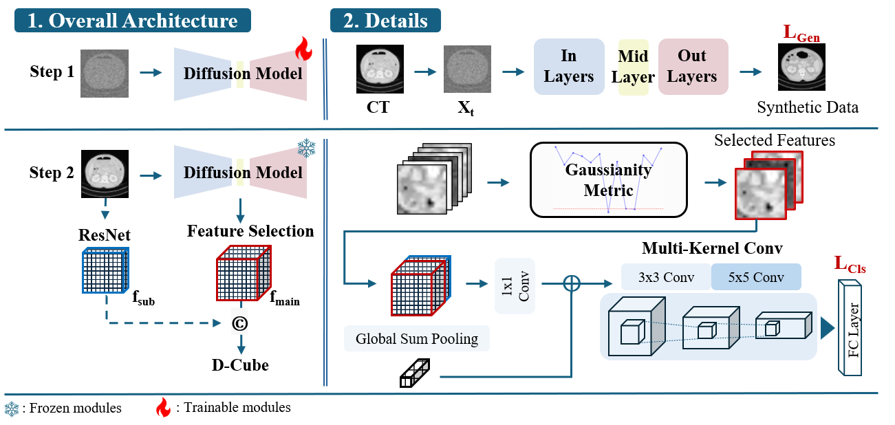
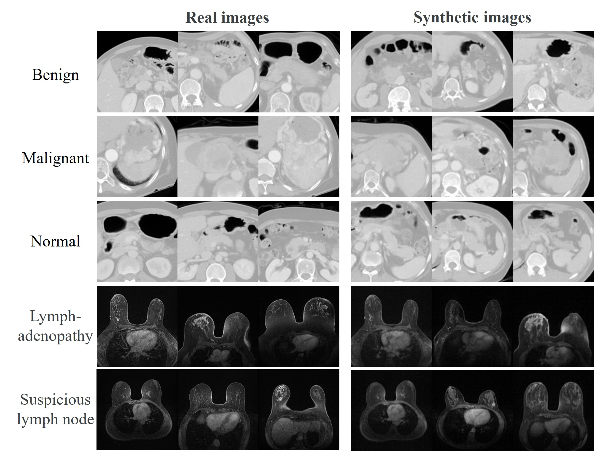

# D-Cube : Exploiting Hyper-Features of Diffusion Model for Robust Medical Classification [[Paper]](https://arxiv.org/abs/2411.11087)
## ICDM 2024 : Official PyTorch Implementation

> #### Authors: [Minhee Jang<sup>1</sup>](https://github.com/minhee-Jang), [Juheon Son<sup>1</sup>](https://github.com/juheonewha), [Thanaporn Viriyasaranon<sup>1</sup>], [Junho Kim<sup>2&dagger;</sup>](https://github.com/taki0112), [Jang-Hwan Choi<sup>1&dagger;</sup>]
> <sup>1</sup> <sub>Ewha Womans University</sub> <sup>2</sup>NAVER AI Lab <sub></sub>
> <sup>&dagger;</sup> <sub> Corresponding author </sub>

#### Abstract
>  ***The integration of deep learning technologies in medical imaging aims to enhance the efficiency and accuracy of cancer diagnosis, particularly for pancreatic and breast cancers, which present significant diagnostic challenges due to their high mortality rates and complex imaging characteristics. This paper introduces Diffusion-Driven Diagnosis (D-Cube), a novel approach that leverages hyper-features from a diffusion model combined with contrastive learning to improve cancer diagnosis. D-Cube employs advanced feature selection techniques that utilize the robust representational capabilities of diffusion models, enhancing classification performance on medical datasets under challenging conditions such as data imbalance and limited sample availability. The feature selection process optimizes the extraction of clinically relevant features, significantly improving classification accuracy and demonstrating resilience in imbalanced and limited data scenarios. Experimental results validate the effectiveness of D-Cube across multiple medical imaging modalities, including CT, MRI, and X-ray, showing superior performance compared to existing baseline models. D-Cube represents a new strategy in cancer detection, employing advanced deep learning techniques to achieve state-of-the-art diagnostic accuracy and efficiency.***

## Diffusion Driven Diagnosis (D-Cube)


## Usage
* ### Data preparation
```
Inputs: .PNG images 
└── <dataset name>
    ├── class1
    │   ├── 001.png
    │   ├── 002.png
    │   ├── 003.png
    │   ├── ...
    │
    └── class2
        ├── 001.png
        ├── 002.png
        └── 003.png
    ...
```
* ### Step 1 : Training a diffusion model
  ```
  > python main_step1.py --dataset_path dataset dir --num_classes number of classes
  ```
* ### Step 2 : Training a Classificer Model
  ```
  > python main_step2.py --dataset_path dataset dir --pretrained pretrained diffusion model path --num_classes number of classes
  ```
* ### Optional Augmentation 
  * e.g.,) If you need to generate 5,000 synthetic images in case of pancreatic cancer,
  ```  
  > python opt_augmentation.py --pretrained ./models/pretrained_pancreas.pt --num_classes 3 --num_synthetic 5000
  ```
  

